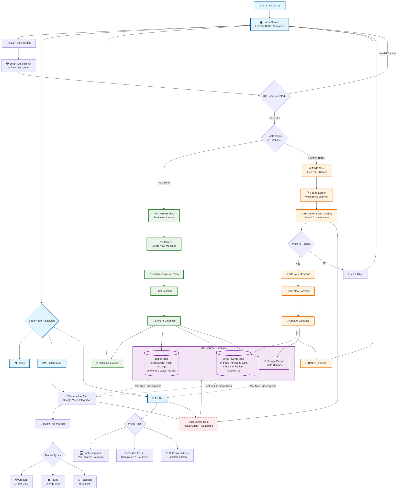

# YMIB App Flow Diagram

## Legend

### 🎨 **Color Coding**
- **Light Blue**: Main user navigation flows
- **Light Green**: CREATE flow (new bottles)
- **Light Orange**: FIND flow (existing bottles)
- **Light Purple**: Database components
- **Light Red (Dashed)**: Real-time data connections

### 📱 **Key Components**
- **Smart QR Scanner**: Automatically routes to CREATE or FIND based on bottle status
- **Enhanced Bottle Journey**: Shows nested conversations and complete bottle trail
- **Trail Markers**: Color-coded map markers showing bottle activity history
- **Real-time Updates**: Live map and profile updates via Supabase subscriptions

### 🔄 **Main User Flows**
1. **Scan → CREATE**: New bottle → Add message → Cast away
2. **Scan → FIND**: Existing bottle → View journey → Optionally retoss
3. **Explore**: View global bottle trail on interactive map
4. **Profile**: Track personal bottle history across three organized tabs 