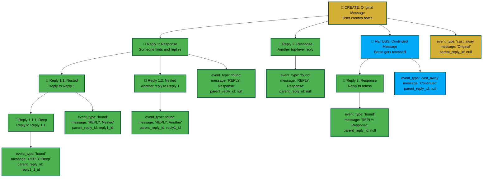
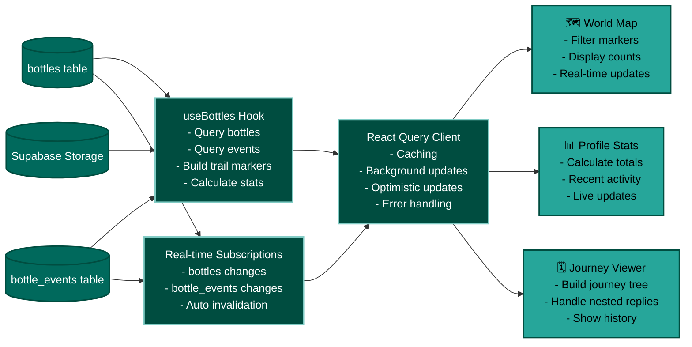

# YMIB (Your Message in a Bottle) - Complete Flow Diagram

```mermaid
flowchart TD
    %% Starting Points
    APP_START[🌊 App Launch]
    
    %% Tab Navigation
    TAB_HOME[🏠 Home Tab]
    TAB_MAP[🗺️ World Map Tab]
    TAB_PROFILE[👤 Profile Tab]
    
    %% Home Tab Flow
    HOME_SCREEN[🏖️ Home Screen<br/>- YMIB Logo<br/>- Cast Your Message Button]
    TOSS_MODAL[🍾 Toss Creation Modal]
    TOSS_COMPOSE[📝 Compose Message<br/>- Text Input 500 chars<br/>- Photo Options<br/>- Take Photo/Gallery]
    TOSS_ANIMATION[🌊 Tossing Animation<br/>- 6 second bottle animation<br/>- Location capture<br/>- Photo upload<br/>- Edge function call]
    TOSS_SUCCESS[✅ Toss Success<br/>- Bottle ID shown<br/>- Continue Exploring]
    
    %% Scanning Flow
    SCAN_MODAL[📱 QR Scanner Modal<br/>- Camera interface<br/>- Dev mode bottle list]
    SCAN_DETECT[🔍 QR Detection<br/>- Parse bottle ID/password<br/>- Check bottle status]
    
    %% Found Flow - Complete 7 Steps
    FOUND_LOADING[⏳ Step 1: Loading<br/>- Validate credentials<br/>- Fetch bottle data<br/>- Determine state]
    FOUND_VIEWING[👀 Step 2: Viewing<br/>- Show bottle content<br/>- View Journey button<br/>- Mark as Found button]
    FOUND_REPLYING[💬 Step 3: Replying<br/>- Reply input 300 chars<br/>- Photo options<br/>- Skip/Submit buttons]
    FOUND_ASK_RETOSS[🔄 Step 4: Ask Retoss<br/>- Retoss now vs Save later<br/>- Decision point]
    FOUND_ADDING[📝 Step 5: Adding<br/>- New message 500 chars<br/>- Photo options<br/>- Retoss button]
    FOUND_RETOSSING[🌊 Step 6: Retossing<br/>- Animation sequence<br/>- Location capture<br/>- Edge function call]
    FOUND_SUCCESS[✅ Step 7: Success<br/>- Confirmation message<br/>- Continue Exploring]
    
    %% Journey Viewer
    JOURNEY_VIEWER[🗓️ Bottle Journey Viewer<br/>- Complete bottle history<br/>- Expandable steps<br/>- Nested replies<br/>- Reply buttons]
    JOURNEY_REPLY[💭 Create Nested Reply<br/>- Navigate to Found flow<br/>- With parent_reply_id]
    
    %% World Map Flow
    MAP_SCREEN[🌍 World Map Screen<br/>- Custom ocean styling<br/>- Global Ocean Chart title<br/>- Filter tabs<br/>- Real-time markers]
    MAP_FILTERS[🔍 Filter System<br/>- All/Created/Found/Retossed<br/>- Dynamic counts<br/>- Visual indicators]
    MAP_MARKERS[📍 Map Markers<br/>- Gold: Created bottles<br/>- Green: Found bottles<br/>- Blue: Retossed bottles<br/>- Smart spacing logic]
    
    %% Profile Flow
    PROFILE_SCREEN[👤 Profile Screen<br/>- Your Ocean Journey<br/>- Stats cards<br/>- Recent activity<br/>- View Journeys button]
    PROFILE_STATS[📊 Live Statistics<br/>- Created: X<br/>- Found: Y<br/>- Retossed: Z<br/>- Calculated from trail data]
    PROFILE_ACTIVITY[📋 Recent Activity<br/>- Last 5 interactions<br/>- Type/Date/Message preview<br/>- Ocean-themed cards]
    
    %% Database Operations
    DB_BOTTLES[(🗄️ bottles table<br/>- id, password_hash<br/>- message, photo_url<br/>- status, lat, lon<br/>- created_at, names)]
    DB_EVENTS[(🗄️ bottle_events table<br/>- id, bottle_id<br/>- event_type, lat, lon<br/>- message, photo_url<br/>- parent_reply_id<br/>- created_at)]
    DB_STORAGE[(📁 Supabase Storage<br/>- Photo uploads<br/>- Image optimization<br/>- CDN delivery)]
    
    %% Edge Functions
    EDGE_TOSS[⚡ toss_bottle Function<br/>- Generate password<br/>- Create bottle record<br/>- Create cast_away event<br/>- Return ID/password]
    EDGE_CLAIM[⚡ claim_or_toss_bottle Function<br/>- Validate credentials<br/>- Determine action type<br/>- Update bottle status<br/>- Create appropriate event]
    
    %% Real-time System
    REALTIME[📡 Real-time Updates<br/>- Supabase subscriptions<br/>- React Query invalidation<br/>- Smart polling fallback<br/>- Activity-based updates]
    
    %% Data Hooks
    HOOK_BOTTLES[🪝 useBottles Hook<br/>- Fetch all bottles<br/>- Fetch all events<br/>- Build trail markers<br/>- Calculate statistics<br/>- Real-time subscriptions]
    
    %% Flow Connections - App Start
    APP_START --> TAB_HOME
    APP_START --> TAB_MAP
    APP_START --> TAB_PROFILE
    
    %% Home Tab Flow
    TAB_HOME --> HOME_SCREEN
    HOME_SCREEN --> TOSS_MODAL
    TOSS_MODAL --> TOSS_COMPOSE
    TOSS_COMPOSE --> TOSS_ANIMATION
    TOSS_ANIMATION --> TOSS_SUCCESS
    TOSS_SUCCESS --> HOME_SCREEN
    
    %% Scanning and Found Flow
    HOME_SCREEN -.-> SCAN_MODAL
    TAB_MAP -.-> SCAN_MODAL
    TAB_PROFILE -.-> SCAN_MODAL
    SCAN_MODAL --> SCAN_DETECT
    SCAN_DETECT --> FOUND_LOADING
    
    %% Complete Found Flow Sequence
    FOUND_LOADING --> FOUND_VIEWING
    FOUND_VIEWING --> FOUND_REPLYING
    FOUND_VIEWING --> JOURNEY_VIEWER
    FOUND_REPLYING --> FOUND_ASK_RETOSS
    FOUND_ASK_RETOSS --> FOUND_ADDING
    FOUND_ASK_RETOSS --> HOME_SCREEN
    FOUND_ADDING --> FOUND_RETOSSING
    FOUND_RETOSSING --> FOUND_SUCCESS
    FOUND_SUCCESS --> HOME_SCREEN
    
    %% Alternative Found Flow (Already Found Bottle)
    FOUND_LOADING -.-> FOUND_ASK_RETOSS
    
    %% Journey Viewer Flow
    JOURNEY_VIEWER --> JOURNEY_REPLY
    JOURNEY_REPLY --> FOUND_LOADING
    
    %% World Map Flow
    TAB_MAP --> MAP_SCREEN
    MAP_SCREEN --> MAP_FILTERS
    MAP_SCREEN --> MAP_MARKERS
    MAP_MARKERS --> JOURNEY_VIEWER
    
    %% Profile Flow
    TAB_PROFILE --> PROFILE_SCREEN
    PROFILE_SCREEN --> PROFILE_STATS
    PROFILE_SCREEN --> PROFILE_ACTIVITY
    PROFILE_SCREEN --> JOURNEY_VIEWER
    
    %% Database Connections
    TOSS_ANIMATION --> EDGE_TOSS
    FOUND_RETOSSING --> EDGE_CLAIM
    EDGE_TOSS --> DB_BOTTLES
    EDGE_TOSS --> DB_EVENTS
    EDGE_CLAIM --> DB_BOTTLES
    EDGE_CLAIM --> DB_EVENTS
    TOSS_COMPOSE --> DB_STORAGE
    FOUND_REPLYING --> DB_STORAGE
    FOUND_ADDING --> DB_STORAGE
    
    %% Data Flow
    DB_BOTTLES --> HOOK_BOTTLES
    DB_EVENTS --> HOOK_BOTTLES
    HOOK_BOTTLES --> MAP_SCREEN
    HOOK_BOTTLES --> PROFILE_STATS
    HOOK_BOTTLES --> JOURNEY_VIEWER
    
    %% Real-time Updates
    DB_BOTTLES --> REALTIME
    DB_EVENTS --> REALTIME
    REALTIME --> HOOK_BOTTLES
    
    %% Styling
    classDef homeFlow fill:#D4AF37,stroke:#004D40,stroke-width:2px,color:#000
    classDef mapFlow fill:#03A9F4,stroke:#004D40,stroke-width:2px,color:#000
    classDef profileFlow fill:#4CAF50,stroke:#004D40,stroke-width:2px,color:#000
    classDef foundFlow fill:#FFB300,stroke:#004D40,stroke-width:2px,color:#000
    classDef journeyFlow fill:#26A69A,stroke:#004D40,stroke-width:2px,color:#000
    classDef databaseFlow fill:#00695C,stroke:#004D40,stroke-width:2px,color:#fff
    classDef systemFlow fill:#004D40,stroke:#80CBC4,stroke-width:2px,color:#fff
    
    class TAB_HOME,HOME_SCREEN,TOSS_MODAL,TOSS_COMPOSE,TOSS_ANIMATION,TOSS_SUCCESS homeFlow
    class TAB_MAP,MAP_SCREEN,MAP_FILTERS,MAP_MARKERS mapFlow
    class TAB_PROFILE,PROFILE_SCREEN,PROFILE_STATS,PROFILE_ACTIVITY profileFlow
    class SCAN_MODAL,SCAN_DETECT,FOUND_LOADING,FOUND_VIEWING,FOUND_REPLYING,FOUND_ASK_RETOSS,FOUND_ADDING,FOUND_RETOSSING,FOUND_SUCCESS foundFlow
    class JOURNEY_VIEWER,JOURNEY_REPLY journeyFlow
    class DB_BOTTLES,DB_EVENTS,DB_STORAGE,EDGE_TOSS,EDGE_CLAIM databaseFlow
    class HOOK_BOTTLES,REALTIME systemFlow
```

## 🔄 **Nested Reply System Flow**

## 🎯 **State Management Flow**

## 📋 **Legend**

### **Color Coding**
- 🟨 **Yellow (Home Flow)**: Toss creation and home screen functionality
- 🟦 **Blue (Map Flow)**: World map, filters, and global bottle visualization  
- 🟩 **Green (Profile Flow)**: User stats, activity, and personal dashboard
- 🟧 **Orange (Found Flow)**: Complete bottle discovery and interaction flow
- 🟫 **Teal (Journey Flow)**: Bottle journey viewer and nested reply system
- 🟫 **Dark Green (Database)**: Database tables, storage, and edge functions
- 🟫 **Dark Blue (System)**: Hooks, state management, and real-time updates

### **Symbol Key**
- **🏠**: Home/Main screens
- **🍾**: Bottle-related actions
- **📱**: Modal screens
- **💬**: Reply/messaging features
- **🗺️**: Map functionality
- **👤**: Profile features
- **⚡**: Edge functions
- **🗄️**: Database tables
- **🪝**: React hooks
- **📡**: Real-time features

This comprehensive diagram shows every screen, modal, flow, database operation, and system interaction in the YMIB app, making it easy to understand the complete architecture and user journey flows. 